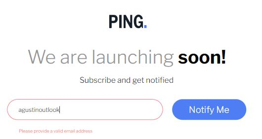
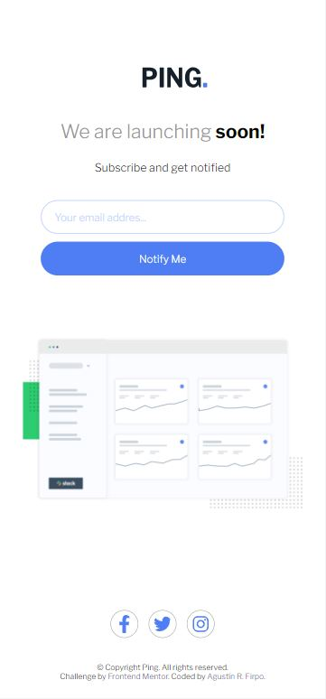

# Frontend Mentor - Ping coming soon page solution


This is a solution to the [Ping coming soon page challenge on Frontend Mentor](https://www.frontendmentor.io/challenges/ping-single-column-coming-soon-page-5cadd051fec04111f7b848da). Frontend Mentor challenges help you improve your coding skills by building realistic projects.

## Table of contents

- [Frontend Mentor - Ping coming soon page solution](#frontend-mentor---ping-coming-soon-page-solution)
  - [Table of contents](#table-of-contents)
  - [Overview](#overview)
    - [The challenge](#the-challenge)
    - [Screenshot](#screenshot)
    - [Links](#links)
  - [My process](#my-process)
    - [Built with](#built-with)
    - [What I learned](#what-i-learned)
    - [Useful resources](#useful-resources)
  - [Author](#author)

## Overview

### The challenge

Users should be able to:

- View the optimal layout for the site depending on their device's screen size
- See hover states for all interactive elements on the page
- Submit their email address using an `input` field
- Receive an error message when the `form` is submitted if:
	- The `input` field is empty. The message for this error should say *"Whoops! It looks like you forgot to add your email"*
	- The email address is not formatted correctly (i.e. a correct email address should have this structure: `name@host.tld`). The message for this error should say *"Please provide a valid email address"*

### Screenshot






### Links

- [Solution - Github Repository](https://github.com/Arfirpo/ping-coming-soon-page-master)
- [Solution - Github Page](https://arfirpo.github.io/ping-coming-soon-page-master/)

## My process

### Built with

- Semantic HTML5 markup
- CSS custom properties
- Flexbox
- CSS Grid
- Mobile-first workflow
- Javascript
- Regular Expresions (js)
- [Font Awesome](https://fontawesome.com/icons) - For icons

### What I learned

in this challenge I reinforced my abilities in general.
However, I learned to validate a form, differentiating the error message according to the input field is empty or the value entered was invalid:

```js
function validateEmail(valueInput, divInput, divError){
    let regExp = /[a-z0-9!#$%&'*+/=?^_`{|}~-]+(?:\.[a-z0-9!#$%&'*+/=?^_`{|}~-]+)*@(?:[a-z0-9](?:[a-z0-9-]*[a-z0-9])?\.)+[a-z0-9](?:[a-z0-9-]*[a-z0-9])?/g;
    if(regExp.test(valueInput) == true){
        hideError(divInput, divError);
    } else{
        if(emailInput.value == ""){
            showError(divInput, divError, `Whoops! It looks like you forgot to add your email`);
        } else {
            showError(divInput, divError, `Please provide a valid email address`);
        }
        
    }
}

function showError(divInput, divError, error){
    divInput.style.border = '1px solid var(--LightRed)';
    divError.innerHTML = `<p class="suscription__error-message">${error}</p>`;
}

function hideError(divInput, divError){
    divInput.style.border = `2px solid var(--PaleBlue)`;
    divError.innerHTML = " ";
}
```

### Useful resources

- [Regexr](https://www.example.com) - This page provided me with a regular expression to validate the emails in my code.

## Author

- [Linkedin - Agustín R. Firpo](https://www.linkedin.com/in/agustin-rodrigo-firpo-0aa86697/)
- [@Arfirpo](https://www.frontendmentor.io/profile/Arfirpo)
